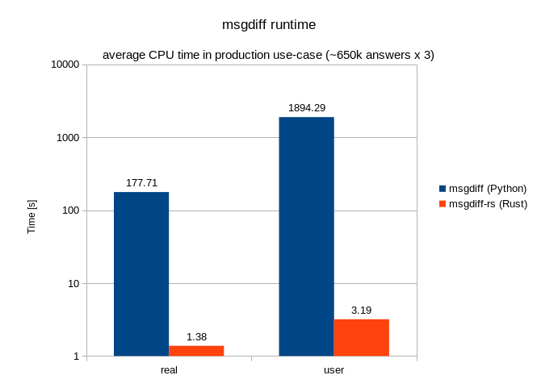

Respdiff (Rust)
===============

This project contains Rust rewrite of selected respdiff scripts.

For main respdiff repository, see https://gitlab.nic.cz/knot/respdiff

msgdiff
-------

The msgdiff rewrite isn't as feature-complete as the Python version, but it can serve as a drop-in replacement for most use configurations. In our use, it proved to be two orders of magnitude faster than the Python version.

